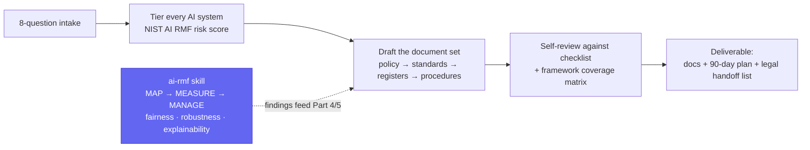

# ai-governance-skills

**Give your coding agent the ability to draft your company's AI governance program — the whole thing, not a boilerplate PDF.**

[](LICENSE)
[](https://agentskills.io)
[](skills/ai-policy/references/regulatory-landscape.md)
[](https://skills.sh/rohanpradyumna/ai-governance-skills)
[](#contributing)

Works with Claude Code, Cursor, Codex, GitHub Copilot, Gemini CLI, Windsurf, Cline, Amp and any agent that supports the [Agent Skills](https://agentskills.io) format.

## Why

Most companies' AI policy is one of two things: nothing, or a PDF from 2023 that has never heard of an agent that can open a PR, spend money, or email a customer on the company's behalf. Regulators, auditors and enterprise procurement teams now ask "how do you govern your AI" as a standard question — and "we don't really have that written down" is not an answer anyone wants to give twice.

This isn't a fill-in-the-company-name policy generator. It tiers every AI system you actually run, cites the specific NIST/ISO/EU AI Act clause behind every requirement, and tells you exactly which items still need a lawyer's signature instead of pretending to be one.

## What it does



Two skills, one job split cleanly in two:

| | [`ai-policy`](skills/ai-policy) | [`ai-rmf`](skills/ai-rmf) |
|---|---|---|
| Answers | "What should our AI rules *be*?" | "Does this specific AI system actually *pass*?" |
| Produces | The governance document set — policy, standards, registers, procedures | Per-system fairness / robustness / explainability / privacy findings |
| Owns regulatory facts | Yes — the single source of truth | No — defers to `ai-policy` so the two never drift apart |

## Install

```bash
# project scope (committed with your repo)
npx skills add rohanpradyumna/ai-governance-skills

# user scope (available in every project)
npx skills add rohanpradyumna/ai-governance-skills -g
```

Then just ask. Both skills activate on requests like *"write our AI usage policy"*, *"build an AI governance framework"*, *"set guardrails for our support agents"*, *"map our AI policy to NIST and ISO 42001"*, or *"evaluate this model for bias."*

## `ai-policy` — the governance document set

Takes a company from *"we should probably have an AI policy"* to a coherent document set: policy → standards → registers → procedures. Runs a short intake (≤ 8 questions), tiers every AI system by risk, drafts from templates, self-reviews against a checklist, and produces a framework coverage matrix plus a legal-review handoff list.

**What it produces** (depending on chosen depth — Starter / Standard / Comprehensive):

| Document | Purpose |
|---|---|
| AI Governance Policy | Board-level master policy (ISO/IEC 42001 Cl. 5.2), ≤ 6 pages, with risk-tier schedule, applicable-law schedule and optional Statement of Applicability |
| AI Acceptable Use Standard | 1–3 page employee-facing rules: named approved tools, data-class matrix, never-list, consequences |
| AI Agent Standard | Mandatory whenever AI takes actions: per-agent identity, least agency, tool/data allowlists, action-class approval gates, caps, kill switch, log schema, injection defences, disclosure, scope-change re-approval |
| AI System Register (+ CSV) | Inventory schema incl. autonomy level, tools, tier, legal class, oversight role, evidence locations, shadow-AI discovery |
| AI Risk Assessment | Per-system NIST MAP/MEASURE/MANAGE assessment with modular DPIA and FRIA sections |
| AI Incident Response Runbook | AI and agent-specific incident categories, severities, halt → contain → preserve → notify → learn, notification-duty table |
| AI Governance Committee Charter | Authority, membership, quorum, standing agenda, metrics |
| Vendor AI Due Diligence Questionnaire | Data use, security, model change, agent capabilities, IP, exit |
| AI Literacy & Training Plan | Role-based modules satisfying EU AI Act Art. 4 / Art. 26(2) and ISO 42001 Cl. 7 |
| Coverage matrix | Every applicable framework requirement → document → clause → status |

**Frameworks and law encoded** (regulatory snapshot **September 2026**):

- NIST AI RMF 1.0 + Playbook, NIST AI 600-1 (GenAI profile)
- ISO/IEC 42001:2023 (all 38 Annex A controls), ISO/IEC 23894, ISO/IEC 42005
- EU AI Act — Art. 4 literacy, Art. 5 prohibitions, Art. 50 transparency incl. the 2026 agent-disclosure guidelines, Art. 26/27 deployer duties, GPAI, Digital Omnibus timeline changes
- US: CCPA ADMT regulations, California FEHA ADS rules, Colorado SB 26-189 (the ADMT Act that replaced the 2024 Colorado AI Act), Texas TRAIGA, Illinois HB 3773, NYC Local Law 144, Utah, federal sector law (EEOC, ECOA/CFPB, FTC, HIPAA, GLBA/SR 11-7, NAIC)
- UK, Singapore (IMDA Model AI Governance Framework for **Agentic AI**, 2026), South Korea, China, others in brief
- OWASP Top 10 for Agentic Applications (2026) and for LLM Applications (2025), MITRE ATLAS, CSA AICM

<details>
<summary><strong>Folder structure</strong></summary>

```
skills/ai-policy/
├── SKILL.md                  # workflow, writing rules, agentic minimums, gotchas
├── references/                # loaded on demand
│   ├── regulatory-landscape.md   # dated, with "policy clause implication" per rule
│   ├── frameworks-crosswalk.md   # NIST ↔ ISO 42001 ↔ EU AI Act ↔ IMDA ↔ OWASP by policy section
│   ├── agentic-ai-controls.md    # autonomy scale, action classes, control catalogue A–G
│   ├── risk-tiering.md           # 7-dimension scoring → 4 tiers → controls matrix
│   ├── governance-operating-model.md
│   ├── data-and-privacy.md
│   ├── vendor-and-procurement.md
│   ├── review-checklist.md
│   └── sources.md                # primary sources only
└── assets/                    # fill-in templates with {{placeholders}}
```

</details>

## `ai-rmf` — the technical evaluation companion

Where `ai-policy` drafts the governance *document set*, `ai-rmf` does the technical NIST AI RMF **MAP → MEASURE → MANAGE** work on a specific AI/ML system: fairness and bias testing, robustness/adversarial evaluation, explainability and model cards, privacy leakage, and accuracy per data slice. Its findings feed straight into `ai-policy`'s `assets/ai-risk-assessment.md` (Parts 4, 5, 9, 10) — it deliberately carries no regulatory facts of its own, deferring to `ai-policy`'s `references/regulatory-landscape.md` so the two never drift out of sync.

Use it when the ask is "evaluate this model/system for bias/fairness/robustness" rather than "write our AI policy." Works standalone too, with its own lightweight output format, if you only need the technical read.

<details>
<summary><strong>Folder structure</strong></summary>

```
skills/ai-rmf/
└── SKILL.md   # MAP/MEASURE/MANAGE workflow, fairness/robustness/explainability methodology and tooling, boundaries
```

</details>

## Example prompts

- *"Write an AI usage policy for our 40-person design agency. We use ChatGPT Team, Midjourney and Copilot."*
- *"We're a 2,000-person SaaS company selling into the EU with Claude-based support agents that can issue refunds. Build our AI governance framework."*
- *"Here's our current AI policy. Map it to NIST AI RMF and ISO 42001 and tell us what's missing."*
- *"Draft an AI agent standard for our engineering team's coding agents that open PRs and deploy to staging."*
- *"Run a fairness and robustness evaluation on our resume-screening model and tell me what's actually broken."*

## Important

**This is not legal advice.** The skill produces drafts for review by qualified counsel, HR, privacy and security professionals. AI regulation changes monthly; the skill dates its regulatory facts, marks items that were mid-change at the snapshot (⚠), and hands the user a verification list with primary sources. Always confirm deadlines and obligations against the sources in `references/sources.md` before adopting a policy.

## Contributing

Regulatory updates are the most valuable contribution. Open a PR against `skills/ai-policy/references/regulatory-landscape.md` with a primary source and update the snapshot date in `SKILL.md` frontmatter (`metadata.regulatory-snapshot`). Keep `SKILL.md` under 500 lines; put detail in `references/`.

## License

MIT — see [LICENSE](LICENSE).
